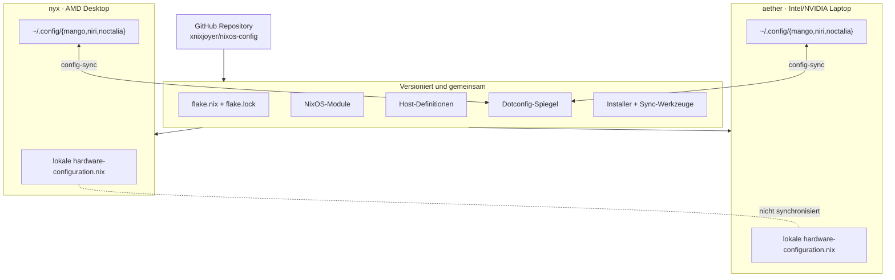
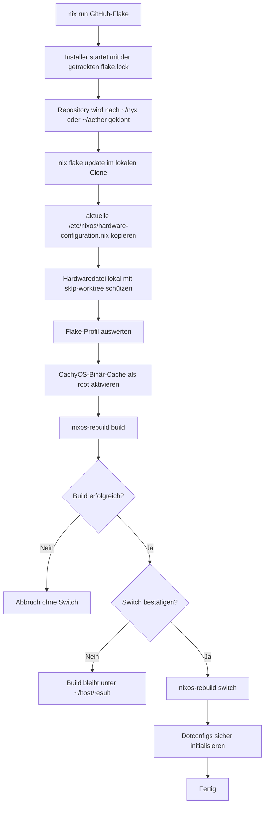
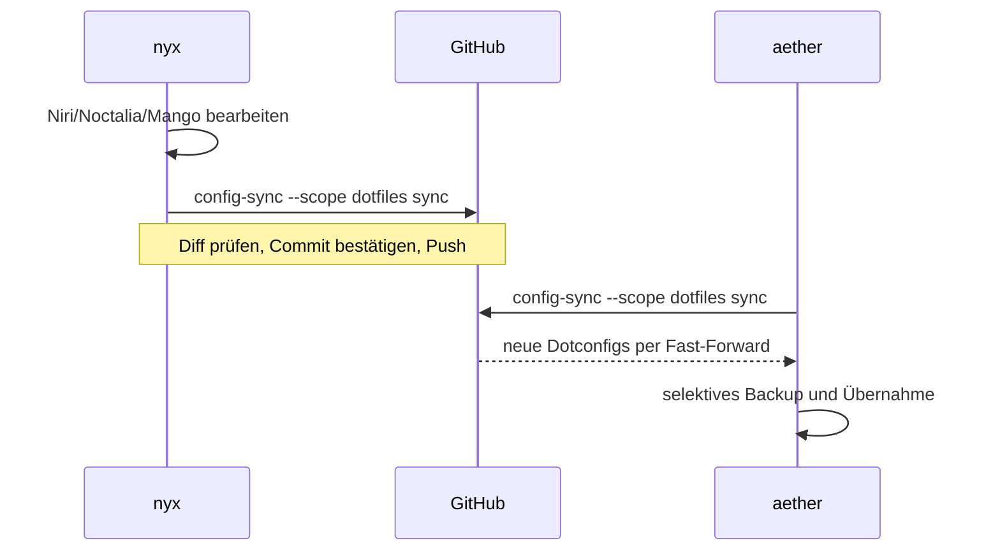
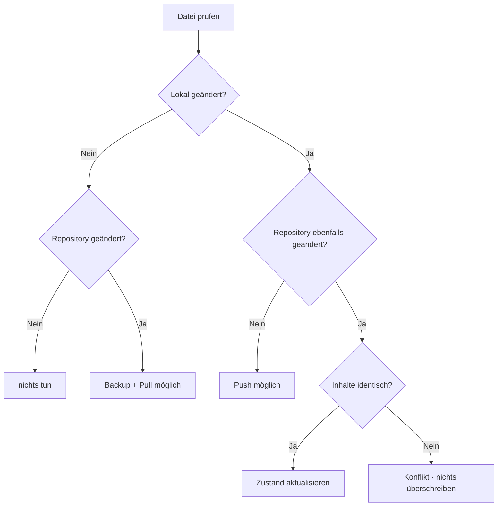
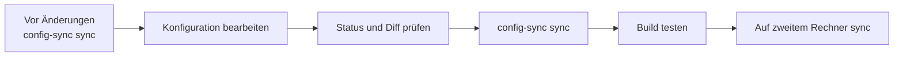

<div align="center">


# NixOS Multi-Host Configuration

**Reproduzierbare NixOS-Installation für `nyx` und `aether` mit Mango, Niri, Noctalia, CachyOS-Kernel und manuellem Dotfile-Sync.**

[](https://nixos.org)
[](https://nix.dev/concepts/flakes.html)
[](https://github.com/nix-community/home-manager)
[](#desktop-profile)
[](#dotconfigs-synchronisieren)

</div>

---

## Überblick

Dieses Repository verwaltet zwei Rechner mit einer gemeinsamen modularen NixOS-Konfiguration:

| Host | Gerät | Grafik | CPU-Tuning | Standardprofil |
|---|---|---|---|---|
| `nyx` | AMD-Desktop | AMD | `znver4` | Mango + Niri |
| `aether` | Intel/NVIDIA-Laptop | Intel + NVIDIA PRIME | `x86-64-v3` | Mango + Niri |

Zusätzlich werden diese Benutzerkonfigurationen manuell und versioniert synchronisiert:

```text
~/.config/mango
~/.config/niri
~/.config/noctalia
```

> [!IMPORTANT]
> `hardware-configuration.nix` bleibt **lokal pro Rechner**. Sie wird bei der Installation aus `/etc/nixos/hardware-configuration.nix` übernommen und nicht zwischen `nyx` und `aether` synchronisiert.

---

## Architektur



### Was liegt wo?

| Inhalt | Speicherort | GitHub-Sync | Automatisch |
|---|---|---:|---:|
| NixOS-Module | `modules/` | Ja | Nein |
| Hostdefinitionen | `hosts/*/default.nix` | Ja | Nein |
| Flake-Inputs | `flake.lock` | Ja | Update beim Installer |
| Hardwarekonfiguration | `hosts/<host>/hardware-configuration.nix` | Nein, lokal geschützt | Kopie bei Installation |
| Mango-Konfiguration | `~/.config/mango` | Ja | Nur manuell |
| Niri-Konfiguration | `~/.config/niri` | Ja | Nur manuell |
| Noctalia-Konfiguration | `~/.config/noctalia` | Ja | Nur manuell |
| Sync-Zustand und Backups | `~/.local/state/nixos-config` | Nein | Bei Bedarf |

---

# Neuinstallation

## Voraussetzungen

Vor dem Start muss eine normale minimale NixOS-Installation vorhanden sein.

- Der Benutzer heißt exakt `xxxxx`.
- Der Benutzer `xxxxx` gehört zur Gruppe `wheel`.
- `/etc/nixos/hardware-configuration.nix` existiert.
- Netzwerkzugriff auf GitHub und die Nix-Caches funktioniert.
- Der Befehl wird als Benutzer `xxxxx`, nicht als `root`, gestartet.

## Ein Befehl

### Nyx

```bash
nix run --refresh github:xnixjoyer/nixos-config#install -- --nyx
```

### Aether

```bash
nix run --refresh github:xnixjoyer/nixos-config#install -- --aether
```

## Desktop-Profile

| Auswahl | Nyx | Aether | Inhalt |
|---|---|---|---|
| Standard | `--nyx` | `--aether` | Mango + Niri |
| Nur Mango | `--nyx --mango` | `--aether --mango` | Mango |
| Nur Niri | `--nyx --niri` | `--aether --niri` | Niri |
| Beide explizit | `--nyx --both` | `--aether --both` | Mango + Niri |

Beispiel für Nyx mit ausschließlich Niri:

```bash
nix run --refresh github:xnixjoyer/nixos-config#install -- --nyx --niri
```

## Installationsablauf



### Sicherheitsregeln des Installers

1. Das Repository wird nur in `~/nyx` oder `~/aether` verwendet.
2. Vorhandene fremde Git-Remotes werden abgelehnt.
3. Die Hardwaredatei wird nur für den ausgewählten Host kopiert.
4. Vor dem Aktivieren wird immer zuerst gebaut.
5. Ein fehlgeschlagener Build führt zu keinem `switch`.
6. Dotconfigs werden erst nach erfolgreicher Systemaktivierung initialisiert.
7. Bestehende lokale Dateien werden vor einer Überschreibung selektiv gesichert.

---

# Hardwarekonfiguration

## Warum sie nicht aus GitHub übernommen wird

`hardware-configuration.nix` enthält unter anderem:

- Dateisysteme und UUIDs
- Boot- und Geräteinformationen
- Kernelmodule
- Swap-Geräte
- Hardware-spezifische Einstellungen

Diese Werte sind pro Installation und Rechner unterschiedlich. Deshalb verwendet der Installer immer:

```text
/etc/nixos/hardware-configuration.nix
```

und kopiert sie nach:

```text
~/nyx/hosts/nyx/hardware-configuration.nix
```

oder:

```text
~/aether/hosts/aether/hardware-configuration.nix
```

Danach wird die Datei lokal geschützt:

```bash
git update-index --skip-worktree hosts/nyx/hardware-configuration.nix
```

Kontrolle auf Nyx:

```bash
git -C ~/nyx ls-files -v hosts/nyx/hardware-configuration.nix
```

Die Ausgabe beginnt bei aktivem Schutz mit `S`.

## Hardwaredatei später neu erzeugen

```bash
sudo nixos-generate-config --show-hardware-config \
  > /tmp/hardware-configuration.nix

install -m 0644 \
  /tmp/hardware-configuration.nix \
  ~/nyx/hosts/nyx/hardware-configuration.nix

sudo nixos-rebuild build --flake ~/nyx#nyx
sudo nixos-rebuild switch --flake ~/nyx#nyx
```

Für Aether entsprechend `~/aether` und `#aether` verwenden.

---

# Flake-Updates

## Warum `flake.lock` im Repository bleiben muss

Die GitHub-Flake ist während `nix run github:...` schreibgeschützt. Ohne `flake.lock` versucht Nix bereits vor dem Start des Installers eine neue Lockdatei zu schreiben und bricht ab.

Darum gilt:

```text
flake.lock im Repository
        ↓
Installer kann zuverlässig starten
        ↓
nix flake update im lokalen Clone
        ↓
neueste Inputs werden gebaut und getestet
        ↓
getestete flake.lock wird anschließend versioniert
```

> [!WARNING]
> `flake.lock` nicht löschen. Aktualisieren statt löschen.

## Nach erfolgreicher Neuinstallation aktualisierte Inputs speichern

```bash
config-sync \
  --repo ~/nyx \
  --scope nixos \
  push \
  -m "update: Flake-Inputs aktualisiert"
```

Auf Aether:

```bash
config-sync \
  --repo ~/aether \
  --scope nixos \
  push \
  -m "update: Flake-Inputs aktualisiert"
```

---

# CachyOS-Binär-Cache

Der Installer übergibt den CachyOS-Cache für den ersten System-Build ausdrücklich an den als `root` laufenden `nixos-rebuild`-Prozess.

Dadurch können verfügbare Kernel-Binaries heruntergeladen werden, anstatt den Kernel lokal über mehrere Stunden zu kompilieren.

Dauerhafte Konfiguration:

```nix
nix.settings = {
  extra-substituters = [
    "https://attic.xuyh0120.win/lantian"
  ];

  extra-trusted-public-keys = [
    "lantian:EeAUQ+W+6r7EtwnmYjeVwx5kOGEBpjlBfPlzGlTNvHc="
  ];
};
```

Aktiven Daemon prüfen:

```bash
sudo nix config show | grep -E 'substituters|trusted-public-keys'
```

Kernel nach einem Neustart prüfen:

```bash
uname -r
readlink -f /run/current-system/kernel
```

### Warnung beim ersten `nix run`

Diese Meldung kann vor dem Start des Installers erscheinen:

```text
warning: ignoring the client-specified setting 'trusted-public-keys',
because it is a restricted setting and you are not a trusted user
```

Das betrifft die kleine, als normaler Benutzer gestartete GitHub-App. Der eigentliche System-Build erhält den Cache anschließend ausdrücklich als Root-Option.

---

# Dotconfigs synchronisieren

## Synchronisierte Pfade

Die Datei `sync/paths.conf` enthält:

```text
.config/mango
.config/niri
.config/noctalia
```

Der Repository-Spiegel liegt unter:

```text
config/home/.config/
├── mango/
├── niri/
└── noctalia/
```

## Schnellübersicht

| Aufgabe | Nyx | Aether |
|---|---|---|
| Zustand anzeigen | `config-sync --repo ~/nyx --scope dotfiles status` | `config-sync --repo ~/aether --scope dotfiles status` |
| Sicher abgleichen | `config-sync --repo ~/nyx --scope dotfiles sync` | `config-sync --repo ~/aether --scope dotfiles sync` |
| Nur hochladen | `config-sync --repo ~/nyx --scope dotfiles push` | `config-sync --repo ~/aether --scope dotfiles push` |
| Nur herunterladen | `config-sync --repo ~/nyx --scope dotfiles pull` | `config-sync --repo ~/aether --scope dotfiles pull` |
| Historie | `config-sync --repo ~/nyx history config/home` | `config-sync --repo ~/aether history config/home` |
| Diagnose | `config-sync --repo ~/nyx doctor` | `config-sync --repo ~/aether doctor` |

## Empfohlener Alltagsbefehl

Auf Nyx:

```bash
config-sync --repo ~/nyx --scope dotfiles sync
```

Auf Aether:

```bash
config-sync --repo ~/aether --scope dotfiles sync
```

## Ablauf zwischen zwei Rechnern



## Wie Konflikte erkannt werden

Das Werkzeug vergleicht drei Zustände:

| Zustand | Bedeutung |
|---|---|
| Basis | letzter erfolgreicher gemeinsamer Sync |
| Lokal | aktuelle Dateien unter `~/.config` |
| Repository | Dateien unter `config/home/.config` |



> [!NOTE]
> Nicht das Dateidatum entscheidet. Git-Historie und Inhalts-Hashes entscheiden. Unterschiedliche Rechneruhren können dadurch keine neuere Konfiguration versehentlich überschreiben.

## Typischer Arbeitsablauf

Vor dem Bearbeiten:

```bash
config-sync --repo ~/nyx --scope dotfiles sync
```

Konfiguration bearbeiten:

```bash
nano ~/.config/niri/config.kdl
```

Danach erneut synchronisieren:

```bash
config-sync --repo ~/nyx --scope dotfiles sync
```

Auf dem zweiten Rechner:

```bash
config-sync --repo ~/aether --scope dotfiles sync
```

## Selektive Backups

Nur Dateien, die tatsächlich überschrieben oder gelöscht werden, landen unter:

```text
~/.local/state/nixos-config/<repo-id>/backups/<datum-und-uhrzeit>/
```

Unbekannte zusätzliche Dateien werden nicht pauschal gelöscht.

## Schutz vor Secrets

Der Sync blockiert unter anderem verdächtige Dateien wie:

- `.env`
- private Schlüssel und Zertifikate
- Dateien mit `token`, `secret`, `password` oder `credentials` im Namen
- Browser-Cookies und Sitzungsdaten
- Symlinks innerhalb der synchronisierten Bäume

---

# NixOS-Konfiguration synchronisieren

## Lokale NixOS-Änderungen hochladen

```bash
config-sync \
  --repo ~/nyx \
  --scope nixos \
  push \
  -m "nixos(nyx): Beschreibung der Änderung"
```

## Änderungen von GitHub herunterladen

```bash
config-sync --repo ~/nyx --scope nixos pull
```

Wenn relevante NixOS-Dateien aktualisiert wurden, bietet das Werkzeug anschließend einen Build und Switch an.

## Gesamten Stand abgleichen

```bash
config-sync --repo ~/nyx --scope all sync
```

Das umfasst:

- GitHub-Fast-Forward
- NixOS-Konfiguration
- Skripte
- Flake-Dateien
- Dotconfigs
- optionalen System-Build

---

# Skripte aktualisieren

Installierte Werkzeuge:

| Werkzeug | Aufgabe |
|---|---|
| `config-sync` | NixOS- und Dotconfig-Synchronisation |
| `script-update` | Skriptdateien sicher ersetzen oder aus GitHub aktualisieren |
| `save-config` | aktuelle Dotconfigs in den Repository-Spiegel kopieren |
| `nixos-config-install` | Neuinstallation orchestrieren |

## Skripte aus GitHub aktualisieren

```bash
script-update pull
```

## Interaktives Menü

```bash
script-update
```

## Eine heruntergeladene Skriptversion testen und ersetzen

```bash
script-update replace config-sync ~/Downloads/config-sync.py
```

Weitere gültige Werkzeuge:

```text
config-sync
install
save-config
script-update
```

`script-update replace` führt vor dem Ersetzen aus:

1. Syntaxprüfung
2. vollständige Diff-Anzeige
3. Bestätigungsabfrage
4. selektives Backup der alten Skriptdatei
5. optionalen NixOS-Testbuild

Danach versionieren:

```bash
config-sync --repo ~/nyx --scope nixos push
```

---

# Befehlsreferenz

## `config-sync`

| Befehl | Wirkung |
|---|---|
| `status` | Nur Zustand anzeigen |
| `sync` | Sicherer Pull und Push ohne automatische Konfliktentscheidung |
| `push` | Lokale Änderungen committen und pushen |
| `pull` | Fast-Forward-Pull und sichere lokale Übernahme |
| `init` | Lokalen Synchronisationszustand anlegen |
| `history` | Git-Historie anzeigen |
| `doctor` | Repository, Remote, Pfade und Zustand prüfen |

## Globale Optionen

| Option | Bedeutung |
|---|---|
| `--repo PFAD` | Repository explizit angeben |
| `--scope all` | NixOS und Dotconfigs |
| `--scope nixos` | Nur Repository-/NixOS-Dateien |
| `--scope dotfiles` | Nur Mango, Niri und Noctalia |
| `--profile PROFIL` | Flake-Profil explizit setzen |
| `--offline` | Keine Netzwerkoperation |
| `--yes` / `-y` | Bestätigungen automatisch bejahen |

---

# Repository-Struktur

```text
.
├── flake.nix
├── flake.lock
├── hosts/
│   ├── nyx/
│   │   ├── default.nix
│   │   └── hardware-configuration.nix
│   └── aether/
│       ├── default.nix
│       └── hardware-configuration.nix
├── modules/
│   ├── home/
│   └── nixos/
├── config/
│   └── home/
│       └── .config/
│           ├── mango/
│           ├── niri/
│           └── noctalia/
├── scripts/
│   ├── install.sh
│   ├── config-sync.py
│   ├── save-config.sh
│   └── script-update.sh
└── sync/
    ├── paths.conf
    └── excludes.conf
```

---

# Fehlerhilfe

| Meldung | Ursache | Lösung |
|---|---|---|
| `cannot write modified lock file` | `flake.lock` fehlt in der GitHub-Flake | `flake.lock` im Repository behalten |
| `Path ... hardware-configuration.nix is not tracked by Git` | Hardware-Platzhalter fehlt im Repository | getrackte Platzhalterdatei wiederherstellen |
| `Git tree ... is dirty` | lokale Änderungen wie `flake.lock` oder Konfigurationen | `config-sync status` prüfen und bewusst pushen |
| `trusted-public-keys ... restricted setting` | Flake-App läuft als normaler Benutzer | für App-Start harmlos; System-Build nutzt Root-Cacheoptionen |
| `lokale und entfernte Git-Historie sind divergiert` | beide Rechner haben unabhängig Commits erstellt | manuell zusammenführen; kein Force-Push |
| `Konflikte erkannt` | dieselbe Dotconfig-Datei wurde auf beiden PCs verändert | beide Versionen vergleichen und bewusst eine Lösung wählen |
| `Repository enthält lokale Änderungen` | Pull wäre potenziell destruktiv | zuerst `status`, danach `push` oder `sync` |

## Diagnoseblock

Nyx:

```bash
config-sync --repo ~/nyx doctor
git -C ~/nyx status
git -C ~/nyx remote -v
systemctl --failed
```

Aether:

```bash
config-sync --repo ~/aether doctor
git -C ~/aether status
git -C ~/aether remote -v
systemctl --failed
```

## System vor dem Switch nur bauen

```bash
sudo nixos-rebuild build --flake ~/nyx#nyx
```

Erst nach erfolgreichem Build aktivieren:

```bash
sudo nixos-rebuild switch --flake ~/nyx#nyx
```

---

# Empfohlene Routine



### Dotconfigs

```bash
config-sync --repo ~/nyx --scope dotfiles sync
```

### NixOS-Änderungen

```bash
config-sync --repo ~/nyx --scope nixos push
```

### Alles zusammen

```bash
config-sync --repo ~/nyx --scope all sync
```

---

<div align="center">

**Manuell, nachvollziehbar, versioniert und ohne automatische Gewinnerwahl bei Konflikten.**

</div>
